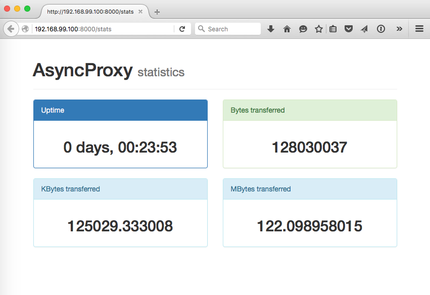

# AsyncProxy

An asynchronous HTTP proxy built with Python and Twisted complying to the requirements specified below:

## Requirements

1. Range requests support as defined in [RFC2616](https://www.ietf.org/rfc/rfc2616.txt), but also via `range` query parameter.

2. Return 416 error in case where both header and query parameter are specified, but with different value.

3. Expose proxy statistics at /stats endpoint (total bytes transferred, uptime).

4. Proxy should be delivered with appropriate `Dockerfile` and `docker-compose.yml` (Hint: use python:3.5 image).

5. Proxy should be configureable via environmental variables.
 
# Dependencie's versions

This software is compatible with **Python 2.7** due to the use of [Twisted](https://twistedmatrix.com/trac/), a library that still is doing the port to Python 3+. Most of the library is already ported but still isn't too stable as with Python 2.7.

Twisted 15.5.0 was used.

For more info, please check requirements.txt inside the server folder.

# Installing

1. Have [Docker](https://www.docker.com/) 1.9.1+ and [Docker Compose](https://docs.docker.com/compose/) 1.5.2+ properly installed and configured.

2. To run locally, have [virtualenv](https://virtualenv.readthedocs.org/en/latest/) (preferably [virtualenvwrapper](https://virtualenvwrapper.readthedocs.org/en/latest/)) installed.

3. Follow the steps bellow:

## Environment variables

**ASYNC_PROXY_SERVER_PORT**

This environment variable tells the proxy in which port to listen.

The configured port also will be exposed in the docker container.

The proxy will start by default at port 8000 if this environment variable wasn't present and with value.

Example:

```bash
$ export ASYNC_PROXY_SERVER_PORT=5000
```
## Clonning

```bash
$ git clone https://github.com/jcfausto/asyncproxy.git
$ cd asyncproxy
```

## Running on Docker
```bash
$ docker-compose up -d #to detach from container after its initialization
$ docker ps # to check if the containter is running. 
```
## Running locally
```bash
$ mkvirtualenv asyncproxy
$ pip install -r requirements.txt
$ twistd --nodaemon --python=server/async_proxy_server.py
```

## Testing

There are some tests written.

```bash
$ nosetests --with-spec ./specs
````

# Using

The easyest way to test is to configure your browser to use this proxy. Start navigating after the configuration and everything should be fine.

If you want to see something happenning, run locally or start the docker container without the "-d" option. 

## Statistics

The proxy was created with an endpoint called **/stats** where you will be able to see the proxy's usage information as shown below:


